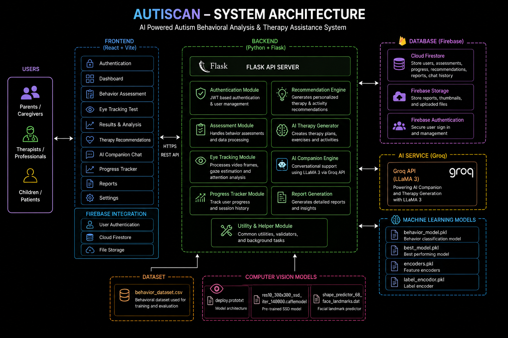
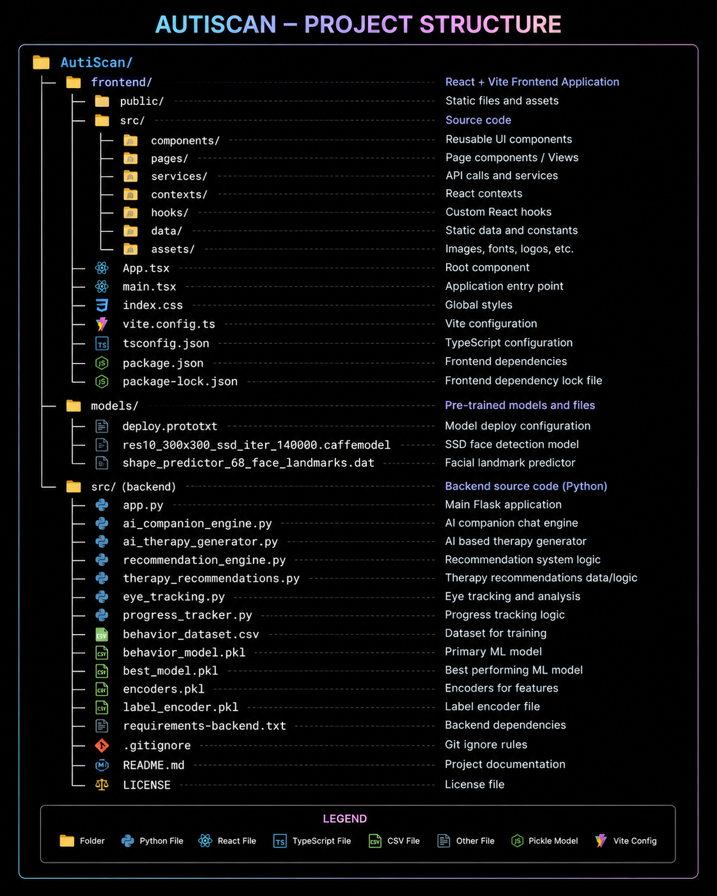
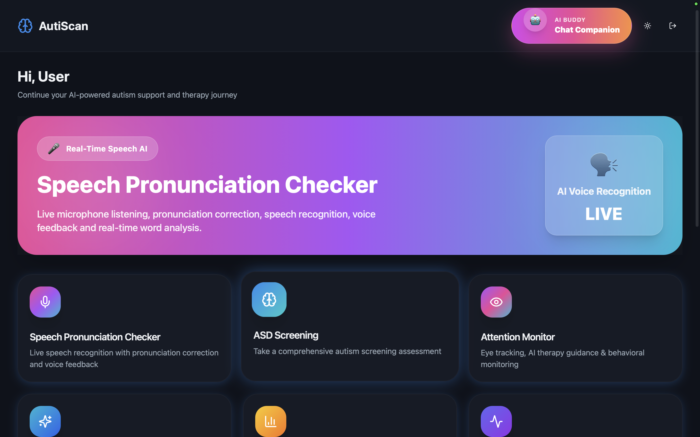
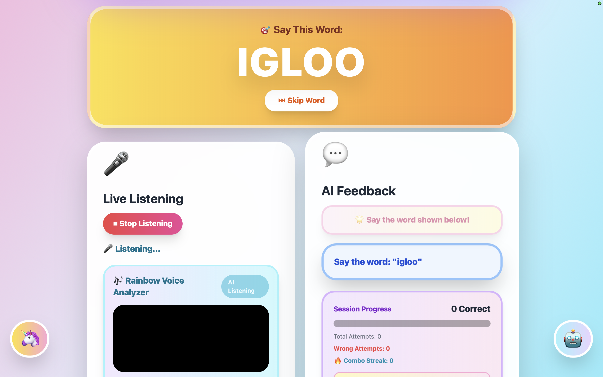
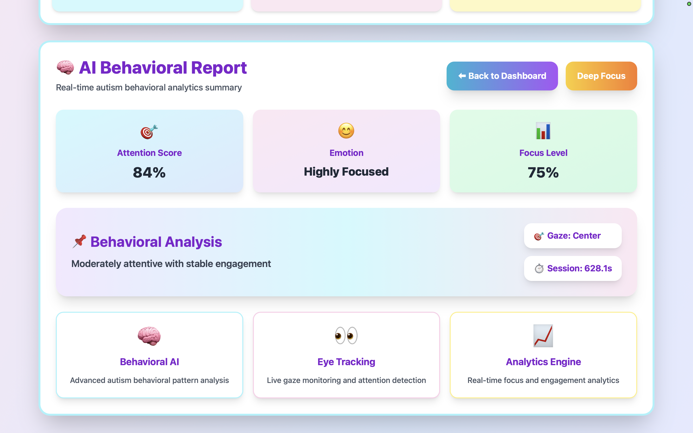

<h1 align="center">AutiScan</h1>
<h2 align="center">AutiScan is an AI-powered Autism Spectrum Disorder (ASD) behavioral analysis and therapy assistance platform. The system combines Machine Learning, Computer Vision, and AI-based recommendation techniques to assist in behavioral assessment, therapy generation, and progress tracking.</h2>
<h2>Live Demo</h2>

```bash
https://autismbuddy.vercel.app
```


<h2>Features</h2>

* Autism behavior prediction using Machine Learning
* Eye tracking and behavioral analysis
* AI-powered therapy recommendation generation
* Personalized therapy suggestions
* Progress tracking system
* Interactive web dashboard
* Real-time prediction and analysis
<h2>Technology Stack</h2>
<h3>Frontend</h3>

* React.js
* TypeScript
* Vite
* Tailwind CSS
<h3>Backend</h3>

* Python
* Flask
* Scikit-Learn
* Pandas
* NumPy
<h3>AI & Machine Learning</h3>

* Behavioral Classification Models
* Recommendation Engine
* Eye Tracking Module
* Therapy Generation System


<h2>Installation</h2>
<h3>Clone Repository</h3>

```bash
git clone https://github.com/USERNAME/AutiScan.git
cd AutiScan
```
<h3>Backend Setup</h3>
Create Virtual Environment

```bash
python -m venv venv
```
<h3>Activate Virtual Environment</h3>
Windows

```bash
venv\Scripts\activate
```
macOS/Linux

```bash
source venv/bin/activate
```
<h3>Install Dependencies</h3>

```bash
pip install -r requirements-backend.txt
```
<h3>Run Backend</h3>

```bash
python app.py
```
<h3>Backend will start on:</h3>

```bash
http://localhost:5002
```

<h3>Frontend Setup</h3>
Navigate to frontend directory:

```bash
cd frontend
```
<h3>Install dependencies:</h3>

```bash
npm install
```
<h3>Run development server:</h3>

```bash
npm run dev
```
<h3>Frontend will start on:</h3>

```bash
http://localhost:8080
```

<h2>Usage</h2>

1. Launch the backend server.
2. Start the frontend application.
3. Open the frontend URL in your browser.
4. Enter behavioral information and assessment data.
5. Generate autism behavior predictions.
6. View therapy recommendations and progress reports.

<h2>Screenshots</h2>


<h3 align="center">Home Page</h3>


<h3 align="center">Speech Therapy</h3>


<h3 align="center">Emotion Monitoring System</h3>
<h2>Future Enhancements</h2>

* Real-time video-based behavioral analysis
* Deep learning-based prediction models
* Therapist dashboard
* Cloud deployment support
* Mobile application integration
* Advanced analytics and reporting
<h2>License</h2>
This project is intended for educational and research purposes.
